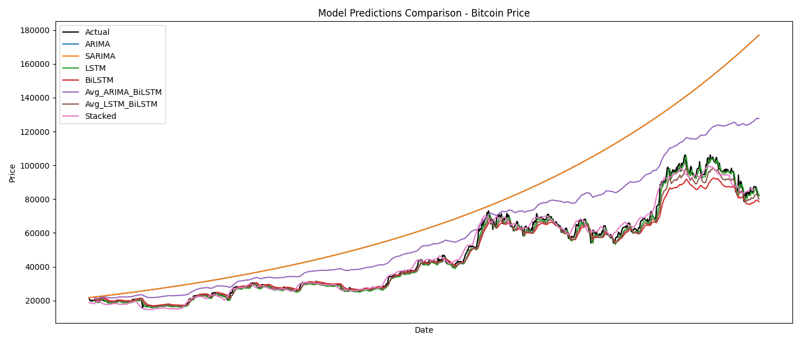

# 📈 CryptoCast: Forecasting Bitcoin with AI

**CryptoCast** is a machine learning-powered project that forecasts future Bitcoin prices using traditional statistical models (ARIMA, SARIMA), deep learning (LSTM, BiLSTM), and ensemble strategies.

---

## 📌 Table of Contents
- [Overview](#overview)
- [Tech Stack](#tech-stack)
- [Project Structure](#project-structure)
- [How to Run](#how-to-run)
- [Modeling Techniques](#modeling-techniques)
- [Results](#results)
- [Conclusion](#conclusion)
- [Screenshots](#screenshots)

---

## 🧠 Overview

This project explores multiple time series forecasting models to predict Bitcoin prices. The goal is to evaluate and compare various algorithms in terms of performance and accuracy — from traditional statistical methods to deep learning.

---

## 🛠️ Tech Stack

- Python 3.x
- Jupyter Notebooks
- Libraries: `pmdarima`, `scikit-learn`, `matplotlib`, `seaborn`, `tensorflow`, `xgboost`, `pandas`, `numpy`
- Deep Learning: LSTM, BiLSTM
- Traditional ML: Linear Regression, Decision Tree, XGBoost
- Ensemble: Average and Stacked Ensemble

---

## 📁 Project Structure

CryptoCast/ ├── data/ # Raw data files ├── models/ # Saved model files (.pkl, .keras) ├── outputs/ │ ├── figures/ # All visualizations │ └── metrics/ # Model predictions and metrics ├── src/ # Preprocessing and utilities ├── notebooks/ # Jupyter modeling notebooks │ └── README.md

---

## 🚀 How to Run

1. **Clone the repository**
   ```bash
   git clone https://github.com/your-username/CryptoCast.git
   cd CryptoCast

Create a virtual environment:
python -m venv venv
source venv/bin/activate  # or venv\Scripts\activate on Windows

Install dependencies:
pip install -r requirements.txt

Run the notebooks Open the notebooks in JupyterLab or Jupyter Notebook and execute each cell in order.

🧪 Modeling Techniques:
| Model                 | Description                                     |
|----------------------|-------------------------------------------------|
| ARIMA                | Classical model for time series prediction      |
| SARIMA               | ARIMA + seasonality                             |
| LSTM                 | Deep learning model using memory cells          |
| BiLSTM               | Bidirectional version of LSTM                   |
| Avg_LSTM_BiLSTM      | Simple average ensemble                         |
| Avg_ARIMA_BiLSTM     | Hybrid average model                            |
| Stacked Ensemble     | Meta-model using predictions from base models   |

📊 Results (Top 3 Models by RMSE):
| Model           | MAE       | RMSE      | R² Score |
|----------------|-----------|-----------|----------|
| **LSTM**       | 1,440.88  | 1,960.98  | 0.9943   |
| **Stacked**    | 1,891.38  | 2,603.45  | 0.9899   |
| **Avg_LSTM_BiLSTM** | 1,910.78  | 2,909.12  | 0.9875   |

📌 Full comparison available in /outputs/metrics/Model_Comparison_Metrics.csv

✅ Conclusion:
Deep learning models, particularly LSTM, outperformed traditional models like ARIMA and SARIMA by a significant margin. While BiLSTM and hybrid ensembles also performed well, LSTM achieved the lowest RMSE and highest R², making it the most reliable for forecasting Bitcoin prices.

However, traditional models still have value due to their simplicity and interpretability. The ensemble models, especially stacking, demonstrate how combining different techniques can further improve accuracy.

📷 Screenshots:
| Model Comparison | Normalized Metrics |
|------------------|--------------------|
|  |  |

📬 Contact:
For suggestions or collaborations, reach out via LinkedIn.